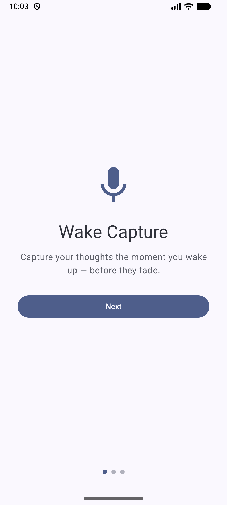
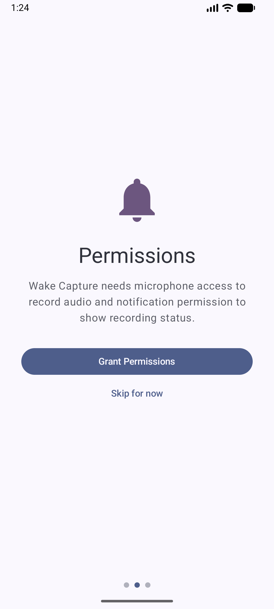
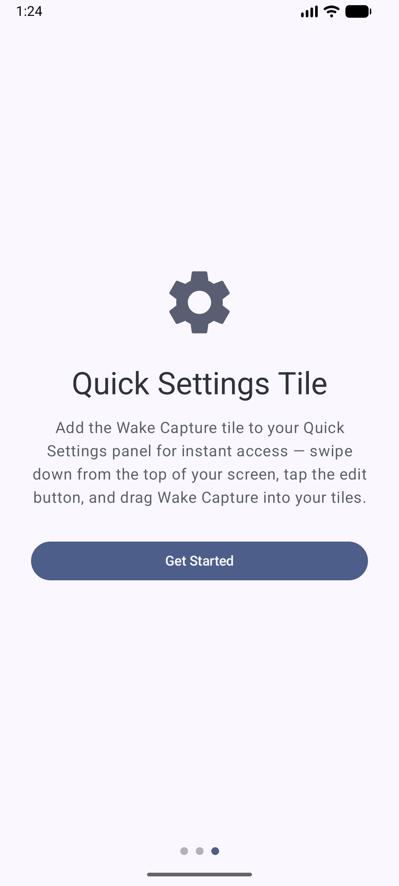
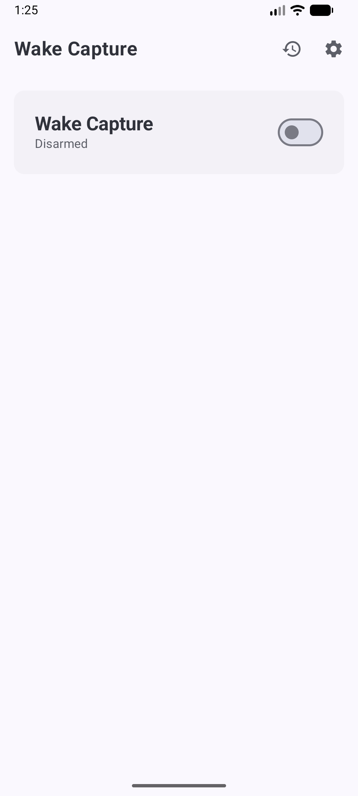
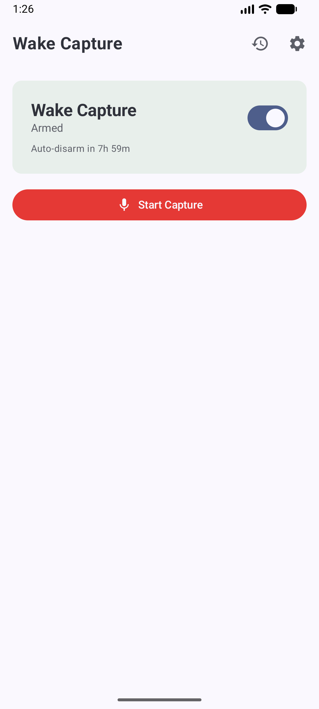
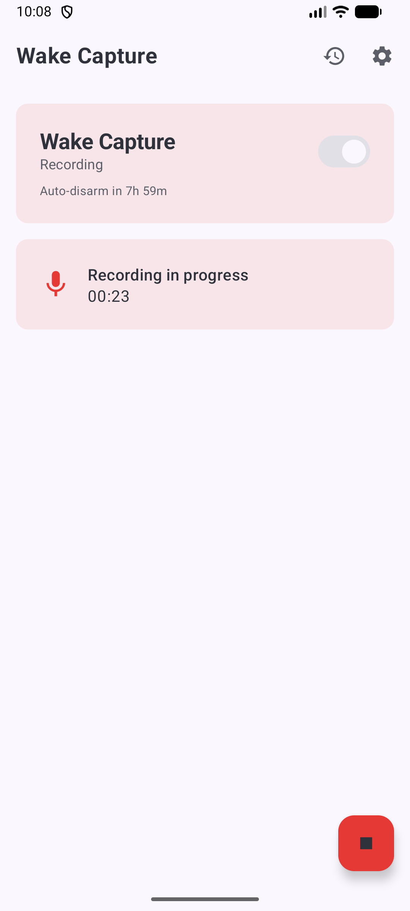
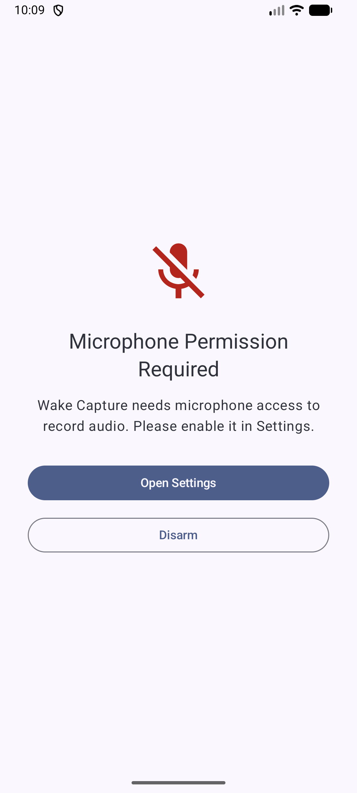

# Wake Capture

Voice memo app built for one specific moment: you just woke up, you're barely conscious, and you have a thought that'll vanish in 30 seconds if you don't record it.

You arm the app before sleep. When you wake, pull down Quick Settings and tap the capture tile, or open the app and hit Start Capture. Audio records to local storage. That's it.

No cloud sync, no transcription (yet), no always-on microphone. The app does exactly one thing and tries not to get in the way while you're half asleep.

## Screenshots

| Onboarding | Permissions | Quick Settings Setup |
|---|---|---|
|  |  |  |

| Disarmed | Armed | Recording | Permission Denied |
|---|---|---|---|
|  |  |  |  |

## How it works

1. **Arm** the app before bed. An auto-disarm timer (default 8 hours) prevents it from staying armed forever.
2. **Capture** when you wake up. The Quick Settings tile works from the lock screen on most devices; the in-app button works when the app is open.
3. **Stop** by tapping the tile again, the stop button in the notification, or the floating stop button in the app. Silence timeout and max duration limits will stop it automatically if you fall back asleep.
4. Audio saves as AAC in an M4A container to private app storage. Recordings survive in a Room database with metadata.

The app stays armed after a recording finishes so you can capture again without re-arming. The auto-disarm countdown keeps running independently.

## Architecture

Kotlin 2.0, Jetpack Compose, single-module Gradle build.

**State machine.** `CaptureCoordinator` owns a `CaptureState` flow: DISARMED → ARMED → STARTING → RECORDING → STOPPING → back to ARMED. Permission denial and failures have their own states. The coordinator is the single source of truth; both the UI and the `CaptureTileService` read from it.

**Recording.** `AudioCaptureService` runs as a foreground service with `foregroundServiceType="microphone"`. Uses `MediaRecorder` behind an `AudioRecorder` interface so the implementation can swap to `AudioRecord` later if silence detection needs raw buffers.

**Persistence.** Arm state and settings live in DataStore (survives process death). Capture records go to Room. Audio files write to `context.filesDir/captures/`.

**DI.** Hilt wires everything. The coordinator, database, and DataStore are all `@Singleton` scoped and shared across `MainActivity`, `AudioCaptureService`, and `CaptureTileService`.

## Building

Requires JDK 17+ and Android SDK 36.

```
./gradlew assembleDebug
```

Install on a connected device or emulator:

```
./gradlew installDebug
```

Min SDK is 33 (Android 13). The app requires `RECORD_AUDIO`, `POST_NOTIFICATIONS`, `FOREGROUND_SERVICE`, and `FOREGROUND_SERVICE_MICROPHONE` permissions.

## Project structure

```
app/src/main/java/com/wakecapture/app/
├── capture/
│   ├── CaptureCoordinator.kt    # state machine, permission checks
│   ├── CaptureState.kt          # state enum with transition validation
│   ├── CaptureRepository.kt     # Room wrapper
│   └── service/
│       ├── AudioCaptureService.kt        # foreground service
│       ├── AudioRecorder.kt              # interface
│       └── MediaRecorderAudioRecorder.kt # AAC/M4A implementation
├── data/
│   ├── CaptureDatabase.kt       # Room database
│   ├── CaptureDao.kt
│   ├── CaptureEntity.kt
│   ├── PreferencesManager.kt    # DataStore preferences
│   └── RecordingFileStore.kt    # file path resolution, storage checks
├── di/                          # Hilt modules
├── system/quicksettings/
│   └── CaptureTileService.kt    # Quick Settings tile
├── ui/
│   ├── MainActivity.kt
│   ├── navigation/NavGraph.kt
│   ├── onboarding/              # 3-page HorizontalPager
│   ├── home/                    # arm toggle, start capture, recording indicator
│   ├── permission/              # mic-revoked screen with auto-restore
│   ├── history/                 # past recordings list
│   ├── detail/                  # single recording playback
│   ├── settings/                # auto-disarm, silence timeout, max duration
│   └── theme/
└── processing/                  # transcription/summarization stubs
```

## What's not built yet

Silence detection (needs `AudioRecord` swap), transcription, cloud backup, home screen widget, assistant integration, process-death recovery for interrupted recordings. See `docs/SPEC.md` for the full plan.

## License

MIT. See [LICENSE](LICENSE).
